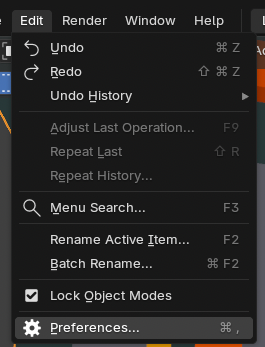
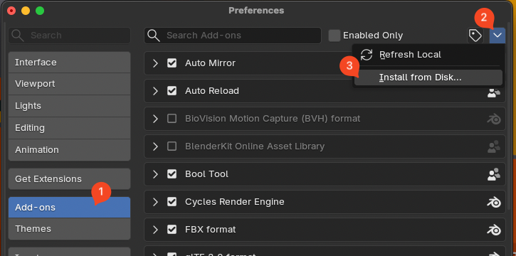
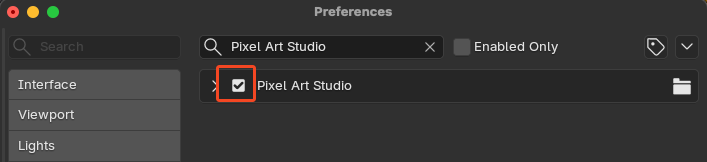
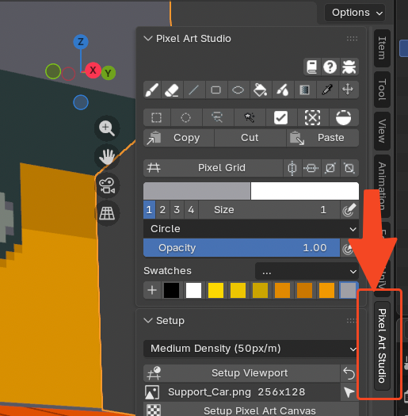

Installation
=========================================

Download and install
------------------------------

- Download Pixel Art Studio from the marketplace of your preference:

  - `itch.io <https://alfredbaudisch.itch.io/pixel-art-studio>`_
  - `Superhive (aka Blender Market) <https://superhivemarket.com/products/pixel-art-studio?ref=10057>`_
  - `Gumroad <https://alfredbaudisch.gumroad.com/l/pixel-art-studio>`_

- In Blender, go to ``Edit > Preferences > Add-ons``, expand ``Add-on Settings`` at the top right corner and choose ``Install from Disk...``.
- Find the zip file you downloaded and choose it.
- Now, activate the addon by clicking the checkbox next to ``Pixel Art Studio``.

.. note::	
    Pixel Art Studio is compatible with **Blender 3.6, Blender 4.0+ through Blender 5.1**. But the **officially supported version is Blender 5.1**.

Open the addon
--------------

In the 3D Viewport or in the Image Editor, press :kbd:`N` and click the ``Pixel Art Studio`` button in the toolbar.

