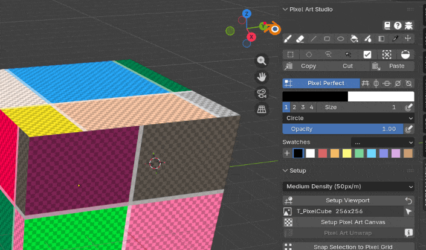
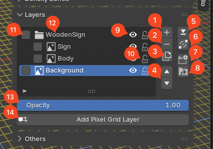

###################
Quickstart Tutorial
###################

This is a how to use / quickstart guide / tutorial to get you started with Pixel Art Studio, a Blender add-on.

**********************
What is Pixel Art Studio?
*************************

See the :doc:`features` page for more details.

**********************
Installation and setup
**********************

See the :doc:`installation` page for more details.

***************************************************
Setup viewport, pixel density, and canvas (texture)
***************************************************

TL;DR Super-quick how to to get started
=========================================

**Model already has a texture?**

1. Click ``Detect Density Zones``
2. Click ``Make Canvas``
3. Click ``Setup Viewport``

Done! You are ready to paint with Pixel Art Studio!

**Model doesn't have a texture?**

1. Choose a density preset in the presets dropdown (chunky big pixels or thin small pixels?)
2. Click ``Setup Viewport``
3. Click ``Setup Pixel Art Canvas`` to create the texture
4. UVs are messed up? Go to Edit Mode, select all vertices, and then click ``Pixel Art Unwrap``.

    - If needed, click ``Setup Pixel Art Canvas`` again to create a new texture with a different resolution.

Done! You are ready to paint with Pixel Art Studio!

For more details and to understand the process, see the sections below. Didn't like the pixel size/texture density? See the sections below as well.

.. _new-project-setup:

1. Setup for new projects (new blend file)
================================================

.. video:: _static/videos/quickstart/quickstart01-setup.mp4
  :width: 100%

1. To start using Pixel Art Studio with a new ``.blend`` file, delete the default cube and make sure you have no object selected.

    - If you already have a model or a blend file where you want to use Pixel Art Studio, keep following along in this section (and skip step 5), make sure you select your existing mesh. Then after done, see the next section :ref:`existing-project-setup`.

2. Expand the sidebar with :kbd:`N` and click ``Pixel Art Studio``.
3. In ``Setup``, choose a Pixel Density Preset or "Custom". The pixel density determines the size of the pixels in the mesh. **Lower density: larger pixels, higher density: smaller pixels** (and thus more details, with the cost of requiring more texture space).
    
    - If you choose "Custom", expand the ``Pixel Density`` section, set the ``Texel Density`` value and press ``Apply Texel Density``.

4. Click ``Setup Viewport`` to match Blender's viewport grid and snapping with the pixel size from the density selected.

    - After clicking ``Setup Viewport``, one grid unit is equal to one pixel.
    - Shading is automatically set to ``Flat > Texture`` (not required, but recommended for pixel art).

5. Click ``Add 1m Cube`` to add a new cube that is one meter in size, adjusted to the grid and texel density: the smaller the density, less pixels fit per meter (the unit of measure for pixel density is ``px/m``).
6. Click ``Setup Pixel Art Canvas``, to create a new texture and automatically assign a material with the texture and no interpolation.

    - You can also check ``Pixel Grid Layer`` to create a new layer containing a generated color grid or a pixel checker texture, so you can visualize each pixel.
7. You are now ready to start painting! Change the view to ``Front Orthographic``, zoom in to see that each grid unit is equal to one pixel in the checker texture.

.. tip::

    If you want bigger or smaller pixels, you can choose another density preset and click ``Setup Pixel Art Canvas`` again or manually type a new ``Texel Density``, click ``Apply Texel Density`` and ``Setup Pixel Art Canvas`` again. Blender's grid follows automatically.

    If ``Setup Viewport`` turns red, click it again to fix the viewport (it does not touch your texture).

.. _existing-project-setup:

2. Setup for existing projects and models
==============================================

.. _existing-not-uv-unwrapped-model:

2.1. The model is not UV unwrapped and not textured
-----------------------------------------------------------

.. video:: _static/videos/quickstart/quickstart-setup-1-no-uv-no-texture.mp4
  :width: 100%

1. Open the ``.blend`` file, select your mesh, and then follow the same steps listed above in :ref:`new-project-setup`.

    - Follow all the steps (except ``Add 1m Cube``) to setup the viewport, pixel density, and canvas.

2. After follow the steps and creating the canvas and the texture with ``Setup Pixel Art Canvas``, switch to ``Edit Mode``, select all vertices, and then click ``Pixel Art Unwrap``.
3. You can choose another density preset or manually type a new one in ``Texel Density``, and re-run ``Setup Pixel Art Canvas`` and ``Pixel Art Unwrap`` until you are happy with the result.

.. note::
    Pixel Art Studio ``Pixel Art Unwrap`` is basic, mostly aimed at rectangular and cube shapes, as all it does is a per-face planar projection with no island rotation and scaling, adds a texel island margin and then it automatically packs the UV islands.
    
    In most cases, it's recommended that you manually UV Unwrap meshes before texture painting them with Pixel Art Studio. See :ref:`existing-uv-unwrapped-model`.

.. _existing-uv-unwrapped-model:

2.2. The model is UV unwrapped and doesn't have a texture
--------------------------------------------------------------------

.. video:: _static/videos/quickstart/quickstart-setup-2-uv-no-texture.mp4
  :width: 100%

1. Open the ``.blend`` file, select your mesh, and then follow the same steps listed above in :ref:`new-project-setup`.

    - Follow all the steps (except ``Add 1m Cube``) to setup the viewport, pixel density, and canvas.

2. As soon as you finish setting up the canvas and the texture with ``Setup Pixel Art Canvas``, you are ready to paint.
3. If you are not satisfied with the pixel sizes laid on your UVs, you can change the density and re-run ``Setup Pixel Art Canvas``.

2.3. The model is UV unwrapped and has a texture
------------------------------------------------

1. Open the ``.blend`` file with the model that you want to texture paint with Pixel Art Studio.
2. The first step is detecting the texel density of your existing texture: does it have multiple sizes or a single pixel size?
3. ``Density Zones`` manages meshes with different texel densities per face (multiple pixel sizes in the same mesh). Expand ``Density Zones`` and click ``Detect Density Zones``.

2.3.1. The mesh has just one pixel size (single texel density)
^^^^^^^^^^^^^^^^^^^^^^^^^^^^^^^^^^^^^^^^^^^^^^^^^^^^^^^^^^^^^^^^^^^^^^^^

.. video:: _static/videos/quickstart/quickstart-setup-3-uv-texture-single-density.mp4
  :width: 100%

1. If just one zone was detected in Density Zones, you can click ``Clear Zones`` to remove it, close the ``Density Zones`` section.
2. Click ``Setup Viewport`` (it automatically detects texel density and sets up the viewport grid, where one grid unit is equal to one pixel size).
3. Click ``Make Canvas``, now Pixel Art Studio is going to work with your existing texture and you are ready to paint.

2.3.2. The mesh has multiple pixel sizes (multiple texel densities)
^^^^^^^^^^^^^^^^^^^^^^^^^^^^^^^^^^^^^^^^^^^^^^^^^^^^^^^^^^^^^^^^^^^^^^^^^^^^

.. video:: _static/videos/quickstart/quickstart-setup-4-uv-texture-many-densities.mp4
  :width: 100%

1. If more than one zone was detect in Density Zones, you are going to have to keep the zones, in order to keep the different pixel sizes. Pixel Art Studio is going to automatically resize and re-point Blender's grid as you hover the mesh's faces with the plugin tools, to keep one grid square at the size of one pixel for that specific face (you don't have to do anything else about it).
2. Click ``Setup Viewport``.
3. Click ``Make Canvas``, now Pixel Art Studio is going to work with your existing texture, with all the different pixel sizes of your mesh and you are ready to paint.
4. See :doc:`density-zones` to learn how to manage and create Density Zones.

********************************************
Drawing and Painting with Pixel Art Studio
********************************************

1. You can use Pixel Art Studio tools in the ``3D Viewport`` (in Object and Edit modes) and in the ``Image Editor`` (2D Viewport). Reveal the sidebar with :kbd:`N` and click ``Pixel Art Studio``.

    - If you want a 2D and a 3D view side by side, use the Pixel Art Studio workspace.

2. Click any of the tools in the sidebar to activate the Pixel Art Studio canvas, and from now on, shortcuts start working and you can draw and paint.

Check the :doc:`shortcuts` page for the full list of shortcuts.

.. warning::
    **The first tool has to be activated by clicking its button** in the sidebar. Until you click one of the tool buttons (like the ``Brush``),, there is no Pixel Art Studio tool listening and Blender keeps catching every key. After you manually activate a tool, all shortcuts below work.
  
.. warning::
    **To get Blender's shortcuts back, you have to manually deactivate the tool.** Click the armed tool's button again to de-activate it (or press :kbd:`ESC` over the viewport). While a tool is armed it owns the keys below, so for example, Blender's :kbd:`G` and :kbd:`B` does not work.

.. note::
    If you activate Pixel Art Studio in the Image Editor, it's going to work ONLY in the Image Editor. To also use it in the 3D viewport, you have to also activate the desired tool in the 3D viewport.

3. The drawing and painting tools work just like most pixel art and painting software, with the difference that they are pixel aware and pixel perfect.

Selections
================================

- There are multiple pixel aware selection tools and you can make selections in both the 2D and 3D viewports.
- Like drawing tools, selections also work like most pixel art and painting software, they work to mask the work area, so the other tools affect only the selected areas.
- If you have a selection you can add to the selection by holding down :kbd:`Shift` and selecting more, you can even use different selection tools to keep adding their selections.
- Hold :kbd:`Alt` to remove from selection.
- Hold :kbd:`Ctrl` to duplicate what is being dragged with the selection.

.. note::
    A selection affects just the currently active layer.

.. tip::
    You can copy, cut and paste what is selected between layers, this is how you can move content between layers.

    .. image:: _static/images/copy-paste-layers.gif

Layers and groups
================================

.. video:: _static/videos/quickstart/layers-basic.mp4
  :width: 100%

Everything in Pixel Art Studio happens inside layers. What you draw, paint and select happens inside layers. Layers can have individual opacity and visibility, and everything inside a group is affected by the group opacity and visibility.

1. New layer
2. Remove layer
3. Duplicate layer
4. Move layer (or group) up and down
5. Merge layer (or group) with the layer below
6. Merge selected layers (or groups). To select, you must check the checkbox next to the layer name (as shown in item 11).
7. New group with the selected layers.
8. Ungroup current active group.
9. Toggle layer visibility.
10. Toggle layer lock. A locked layer cannot be edited.
11. Select layer or group.
12. Double click name to rename layer or group.
13. Layer or group opacity. Everything inside a group is affected by the group opacity.
14. Add pixel grid layer with a generated checker or color grid texture.

***************************************************
Extra Tips
***************************************************

.. tip::
    When a Pixel Art Studio tool is armed and shortcuts are active, you can press :kbd:`F` in the viewports to show the floating tools popover, it appears at mouse position, making it easy and fast to reach tools and colors.

    .. image:: _static/images/floating-tools.png

.. tip::
    When a Pixel Art Studio tool is armed and shortcuts are active, you can press :kbd:`ESC` to deactivate the tool and get Blender's shortcuts back.

.. tip::
    If you are in the 3D viewport and want to reveal the current mesh's texture in the Image Editor, click ``Reveal Texture``. Likewise, if you are in the Image Editor and want to reveal the current mesh in the 3D viewport, click ``Show in 3D Viewport``.

    .. image:: _static/images/reveal-texture.png