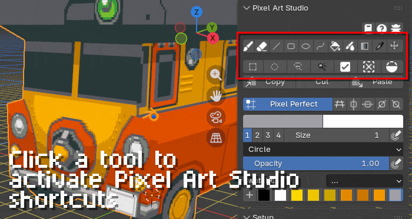
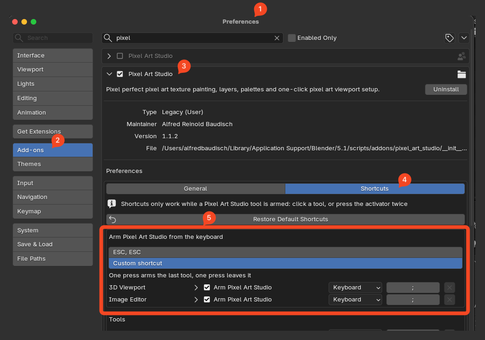

Shortcuts
=========================================

Pixel Art Studio's shortcuts live **inside the tool you have armed**. Shortcuts only work while a Pixel Art Studio tool is active and they never conflict with Blender's own keys. Every shortcut can be customized and re-bound, see :ref:`bindable-shortcuts`.

.. note::
    On macOS every :kbd:`Ctrl` shortcut below maps to :kbd:`Cmd`.

Activator Shortcut
-------------------

**For Pixel Art Studio shortcuts to work, you have to activate a tool first by clicking its button in the sidebar or better yet, you can press ";",** the ``Activator Shortcut`` (by default :kbd:`;` semicolon). By default, the activator toggles on the ``Brush`` and if you had a previously used tool, it will activate your last used tool.

That means you can alternate between Pixel Art Studio and Blender shortcuts back and forth by pressing :kbd:`;` over the viewport:

- Press :kbd:`;` to activate a Pixel Art Studio tool, then freely use Pixel Art Studio shortcuts.
- Press :kbd:`;` again to deactivate the tool and use Blender shortcuts.
- Press :kbd:`;` again to activate Pixel Art Studio and the tool you had last used, so on and so forth.
- You can freely alternate back and forth, it always re-activates the tool you were using last, this way the workflow can be pretty dynamic without needing to click buttons in the sidebar.

The ``Activator Shortcut`` can be changed in :menuselection:`Edit --> Preferences --> Add-ons --> Pixel Art Studio --> Shortcuts`.

.. tip::
  You can also :kbd:`ESC ESC` (two presses of :kbd:`ESC` quickly) as the ``Activator Shortcut`` to toggle the tool on and off.

Tools
-----

.. list-table::
   :widths: 65 35
   :header-rows: 1

   * - Action
     - Keybinding
   * - **Brush**
     - :kbd:`B`
   * - **Eraser**
     - :kbd:`E`
   * - **Line**
     - :kbd:`L`
   * - **Rectangle**
     - :kbd:`U`
   * - **Ellipse**
     - :kbd:`O`
   * - **Path and Polygon** (bezier curve tool)
     - :kbd:`C`
   * - **Bucket fill**
     - :kbd:`G`
   * - **Gradient**
     - :kbd:`D`
   * - **Blur**
     - :kbd:`H`
   * - **Eyedropper**
     - :kbd:`I`
   * - **Move**
     - :kbd:`V`
   * - **Marquee select**
     - :kbd:`M`
   * - **Ellipse select**
     - :kbd:`Shift+M`
   * - **Lasso select**
     - :kbd:`K`
   * - **Magic Wand**
     - :kbd:`W`

To de-activate, click the armed tool's button again, or press :kbd:`ESC` over the viewport.

Brush and colors
----------------

.. list-table::
   :widths: 65 35
   :header-rows: 1

   * - Action
     - Keybinding
   * - **Increase brush size**
     - :kbd:`]`
   * - **Decrease brush size**
     - :kbd:`[`
   * - **Swap primary and secondary color**
     - :kbd:`X`
   * - **Walk to the next swatch**
     - :kbd:`Ctrl+Shift+X`
   * - **Pixel Perfect on / off**
     - :kbd:`P`

Selection
---------

.. list-table::
   :widths: 65 35
   :header-rows: 1

   * - Action
     - Keybinding
   * - **Select all**
     - :kbd:`Ctrl+A`
   * - **Deselect**
     - :kbd:`Alt+A`
   * - **Invert selection**
     - :kbd:`Ctrl+I`
   * - **Add to the selection**
     - :kbd:`Shift` while dragging
   * - **Remove from the selection**
     - :kbd:`Alt` while dragging
   * - **Duplicate the selection**
     - :kbd:`Ctrl` while dragging
   * - **Copy the selected pixels**
     - :kbd:`Ctrl+C`
   * - **Cut the selected pixels**
     - :kbd:`Ctrl+X`
   * - **Paste**
     - :kbd:`Ctrl+V`
   * - **Delete the selected pixels** (or the whole layer when nothing is selected)
     - :kbd:`Backspace` or :kbd:`Delete`

Paste writes into whatever layer is **active**, which is how you move pixels from one layer to another: select on one layer, cut, pick another layer, paste.

View and canvas
---------------

.. list-table::
   :widths: 65 35
   :header-rows: 1

   * - Action
     - Keybinding
   * - **Pixel grid overlay on / off**
     - :kbd:`\\` or :kbd:`Shift+3`
   * - **Floating tools and settings popup on the viewports**
     - :kbd:`F`
   * - **Undo**
     - :kbd:`Ctrl+Z`
   * - **Redo**
     - :kbd:`Ctrl+Shift+Z` or :kbd:`Ctrl+Y`
   * - **Cancel the stroke you are drawing, then de-activate the tool**
     - :kbd:`ESC`

Path and Polygon tool
---------------------

.. list-table::
   :widths: 65 35
   :header-rows: 1

   * - Action
     - Keybinding
   * - **Start a new path**
     - Left click
   * - **Add a new hard corner to the path**
     - Left click and release
   * - **Add a new smooth corner to the path**
     - Left click, hold and drag the mouse
   * - **Close polygon**
     - Left click and release at the first point
   * - **Finish the path as drawn**, leaving it open
     - :kbd:`Enter` or :kbd:`Space`
   * - **Undo a point and go back to the last point**
     - :kbd:`Ctrl+Z` (undo)
   * - **Cancel and clear the path**
     - :kbd:`ESC`, :kbd:`Backspace` or :kbd:`Delete`

Mouse
-----

.. list-table::
   :widths: 65 35
   :header-rows: 1

   * - Action
     - Mouse
   * - **Paint, draw the shape, drag out the selection**
     - Left click and drag
   * - **Temporary eyedropper / color picker** (from any paint tool)
     - :kbd:`Shift+X` + left click (Blender's default)
   * - **Move the selected pixels**
     - Drag from inside the selection
   * - **Duplicate the selected pixels instead of moving them**
     - :kbd:`Ctrl` + drag from inside the selection
   * - **Constrain**: 45 degrees for the line, square for the rectangle, circle for the ellipse
     - :kbd:`Shift` while dragging
   * - **Drag a symmetry ruler** (Image Editor)
     - Left click and drag the ruler
   * - **Remove a swatch**
     - :kbd:`Ctrl` + click the swatch
   * - **Orbit, pan and zoom the viewport**
     - Middle mouse and the wheel, as always

.. _bindable-shortcuts:

Custom shortcuts
--------------------------------------------

It's possible to customize every shortcut used by Pixel Art Studio in :menuselection:`Edit --> Preferences --> Add-ons --> Pixel Art Studio --> Preferences --> Shortcuts`. 

.. image:: _static/images/settings-shortcuts.png

.. tip::
  Click ``Restore Default Shortcuts`` to restore all shortcuts to their default values.

Tools and settings popup
----------------------------------------------

Everything can be quickly accessed with :kbd:`F`, to open the tools and settings popup over the viewports, at mouse position (again, just make sure a tool is armed first by clicking its button, then the :kbd:`F` shortcut works):

.. image:: _static/images/activate-tools-popup.gif