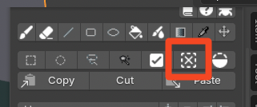
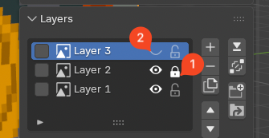
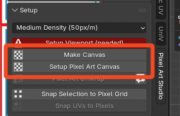
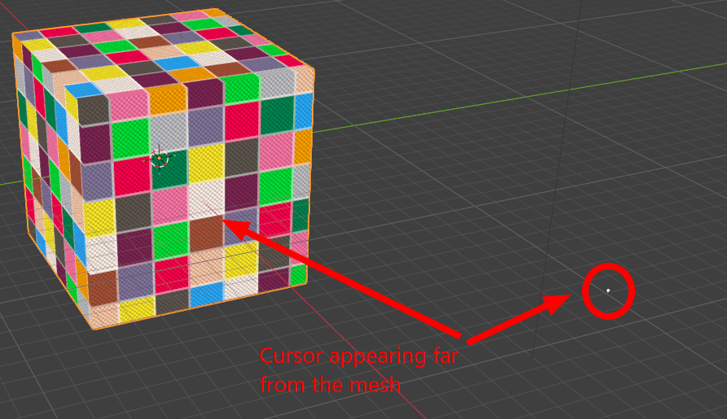
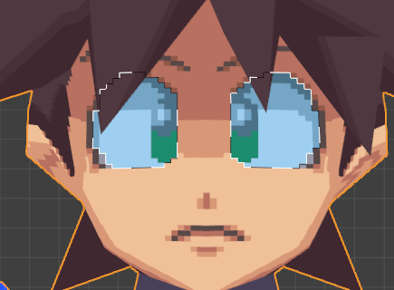
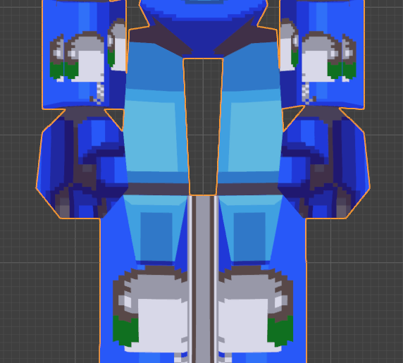
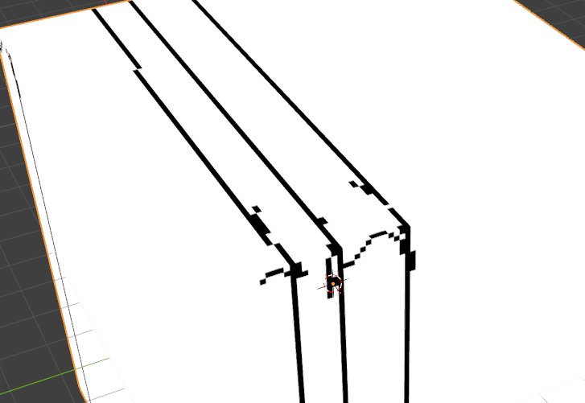
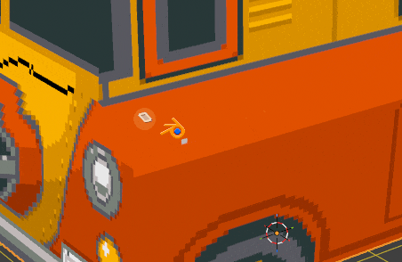

Troubleshooting
=========================================

When I paint with the brush or eraser, sometimes existing colors or pixels are not painted at the cursor's position
---------------------------------------------------------------------------------------------------------------------

* This is probably because you are using the tool with ``Pixel Perfect`` mode enabled, which causes the brush to try to draw smoothed, pixel perfect lines and shapes. Disable it and try again.
* If you are painting on the 3D Viewport, it could also mean the texture density is not set up correctly or that the UVs are distorted.

When I paint or select, nothing happens
------------------------------------------------------------------------------

* Make sure you don't have an active selection somewhere. Press :kbd:`Alt+A` to deselect everything or click ``Deselect`` in the toolbar.

* Make sure you are not trying to paint on a locked or invisible layer.

* Make sure the model and texture that you are trying to paint, are set up with a Pixel Art Studio canvas, click ``Make Canvas`` (if available) or ``Setup Pixel Art Canvas`` in the toolbar to do so.

.. _bad-uvs-troubleshooting:

I cannot see the brush cursor or it is far from the mesh
------------------------------------------------------------------------------------------------

If you are trying to paint on a 3D model, and the pixels are either placed randomly (and not where you clicked) or if the brush cursor appears far from the mesh floating in the 3D viewport, it means the UVs are not set up correctly.

The texture size might also be too small.

You can try:

1. Using the ``Pixel Art Unwrap`` tool to try to manually solve the UVs:

    1. Switch to edit mode, select all vertices
    2. In the Pixel Art Studio toolbar, click ``Pixel Art Unwrap``. Notice that this tool is very basic, see :ref:`existing-not-uv-unwrapped-model` for more details.

2. Manually and correctly UV Unwrap the mesh, before trying to texture paint it.
3. Then in Pixel Art Studio, click ``Setup Pixel Art Canvas`` again to create a new texture of the appropriate size.

    - If your mesh is already textured, then make sure you assign the correct texel and pixel density and click ``Make Canvas``. See the workflow in :ref:`existing-project-setup`.

When I move a selection from one face to another, the pixels get distorted or duplicated
------------------------------------------------------------------------------------------------

- **Pixels distorted, stretched or resized:** this behaviour is correct if your mesh has different texel densities, then when moving between different densities, pixels are going to get placed onto UV islands that have another density.
- **Pixels duplicated:** this behaviour is correct if you land the selection on a face that shares the UV island with other faces.

When I pixel paint, weird lines appear across the texture
------------------------------------------------------------------------------------------------

This is a bug from v1.0.0 and v1.0.1. It's been fixed since v1.0.2.

When I draw and paint with the brush, the strokes appear in multiple places
------------------------------------------------------------------------------------------------

This is because of overlapping UVs.